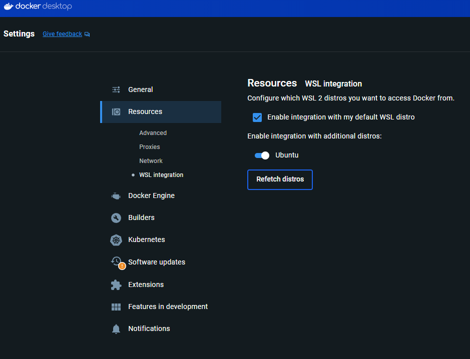

# Software Installation

Before we can begin containerizing our workflows, you will need to set up your local environment.

## 1. Create a Docker Hub Account

Docker Hub is the primary registry for Docker images (think of it as GitHub, but for software containers). We will use it to pull pre-built environments and host our own.

* Navigate to [Docker Hub](https://hub.docker.com/)
* Click **Register** and create a free personal account.
* Verify your email address and save your login credentials, as you will need to log in via the command line later.

## 2. Install Docker Desktop

Docker Desktop is the easiest way to run Docker on your local machine. It includes the Docker daemon, the Docker CLI, and Docker Compose.

* Navigate to the [Get Docker](https://docs.docker.com/get-started/get-docker/) documentation.
* Download the appropriate installer for your operating system.

=== "Windows"
    Download **Docker Desktop for Windows**. Ensure you have WSL 2 (Windows Subsystem for Linux) enabled, as Docker relies on it for optimal performance.
    
    To ensure this is configured correctly, open your Docker Desktop Settings, navigate to **Resources > WSL Integration**, and make sure the integration is enabled for your default WSL distribution:
    
    

=== "macOS"
    Download **Docker Desktop for Mac**. Pay close attention to whether you are downloading the version for **Intel** chips or **Apple Silicon** (M-series chips), as they have different installers.

=== "Linux"
    Follow the repository installation instructions specific to your distribution (Ubuntu, Debian, Fedora, etc.) provided in the Docker documentation.

### Verify Your Installation

Once installed, open your terminal (or PowerShell) and run the following command to ensure Docker is responding:

```bash
docker --version
```
